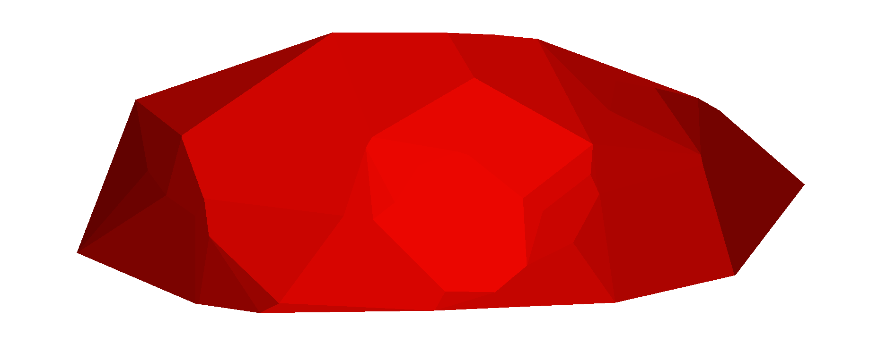

A 2D Rock Generator featuring Real-Time Dynamic Lighting

## Table of Contents

- [Installation](#installation)
- [Usage](#usage)
- [Features](#features)
- [Examples](#examples)
- [Contributing](#contributing)
- [Issues](#issues)
- [License](#license)
- [Contact](#contact)
- [Version History](#version-history)

## Installation

**Windows**: Download the Zip file from [here](https://tank-king.itch.io/PyRock2D) and run the exe file. 
**Mac/Linux**: Clone this repository, and run `main.py` 
**Other Platforms**: Not tested yet, but if python is installed, then similar process as Mac/Linux

## Usage

Clone this repository, and run `main.py`.
Requires: scipy, numpy, pygame-ce

## Features

- change dimensions of rocks
- change angles of rocks
- choose the amount of points used for triangulation
- features real-time dynamic lighting
- geometric data can be exported for physics simulations
- customize the colors of the rock
- export as PNG or JSON formats

## Examples

## Contributing

Describe Issues in the "Issues" section or open a new Pull Request with bug-fixes / enhancements.

## Issues

No issues reported yet

## License

This project is licensed under the [MIT License](LICENSE.md).

## Contact

For questions or support, join my [Discord Server](https://discord.com/invite/qh8XGWypvg)

## Version History

1.0.0.0 -> First stable release

